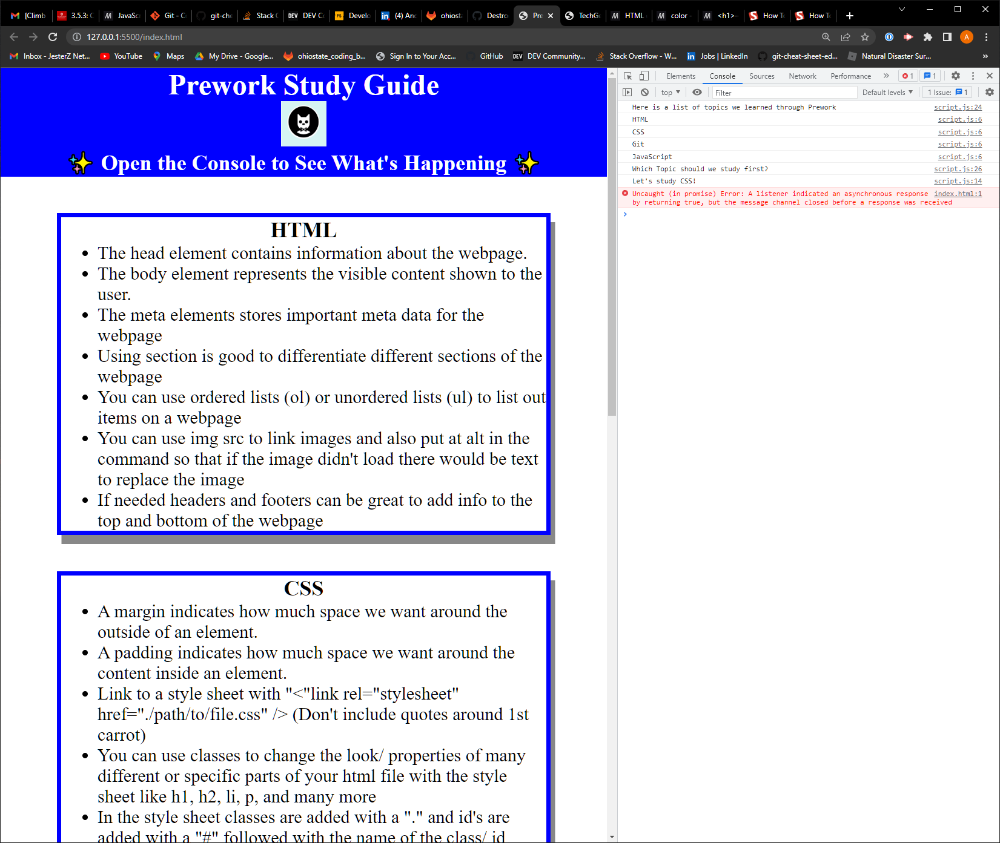

# My Prework Study Guide Webpage

## Description

This Prework Study Guide was created to help me learn important coding topics like HTML, CSS, Git, and JavaScript, while also acting as a cheat sheet with some important tips and reminders that I can refer to while I am working through the OSU course.

This study guide can also be used as a reference for any other students, and people who might benefit from the tips on this Study Guide

## Installation

N/A

## Usage

This Study Guide can be used to help you remember some important tips on basic part of code like HTML, CSS, Git, and JavaScript.

If you open up the DevTools console in your web browser by hitting f12 and clicking on the Console in the top bar, you can see a list of topics that this Study Guide covers, as well as an option of which topic you could start studying first, as seen in the screenshot below. This shows the JavaScript I worked on in action.

## Credits

N/A

## License

Please refer to the LICENSE in the repo.